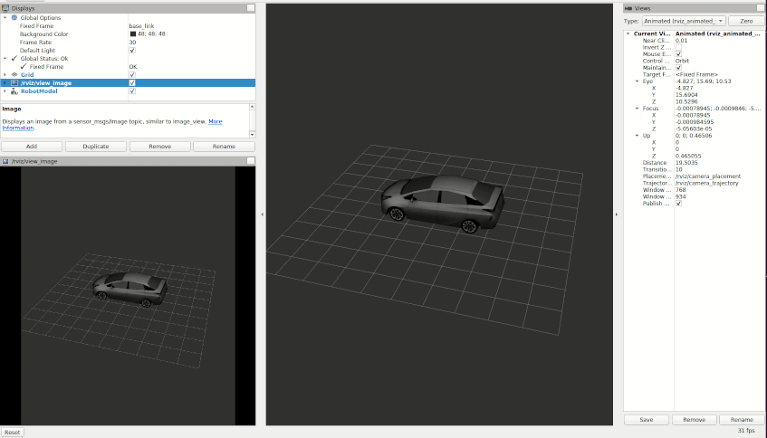
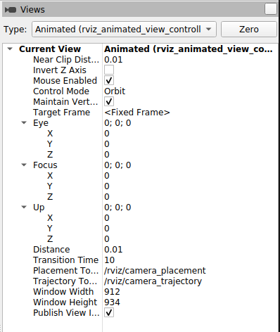

## rviz_animated_view_controller

This package provides a plugin to the default visualization tool of ROS, `rviz`, that allows for automated animated control of the current view of the 3D panel within rviz. Additionally this package allows for publishing of the current view as an image which is useful for creating recordings, etc.




## Installation

The default and recommended way of installation is using the released binaries:

```
sudo apt install ros-<ros-distro>-rviz-animated-view-controller
```


### Buidling from source

Alternatively you can build and install the package from source if you'd like.

All the commands listed below are assumed to be run from your `catkin_ws`.

First clone the package into your `catkin_ws` directory:

```
# make sure you are in your `catkin_ws`
cd catkin_ws
git clone https://github.com/ros-visualization/rviz-animated-view-controller.git
```

Once cloned, install the required dependencies using `rosdep`:

```
rosdep install --from-paths src --ignore-src -y
```

Now you should be able to compile the package:

```
catkin_make
```

After successful compilation, source your overlay and now when you run `rviz` you
should be able to see the plugin listed in the `Views` panel.

```
source devel/setup.bash
rviz
```




## How to use

TODO