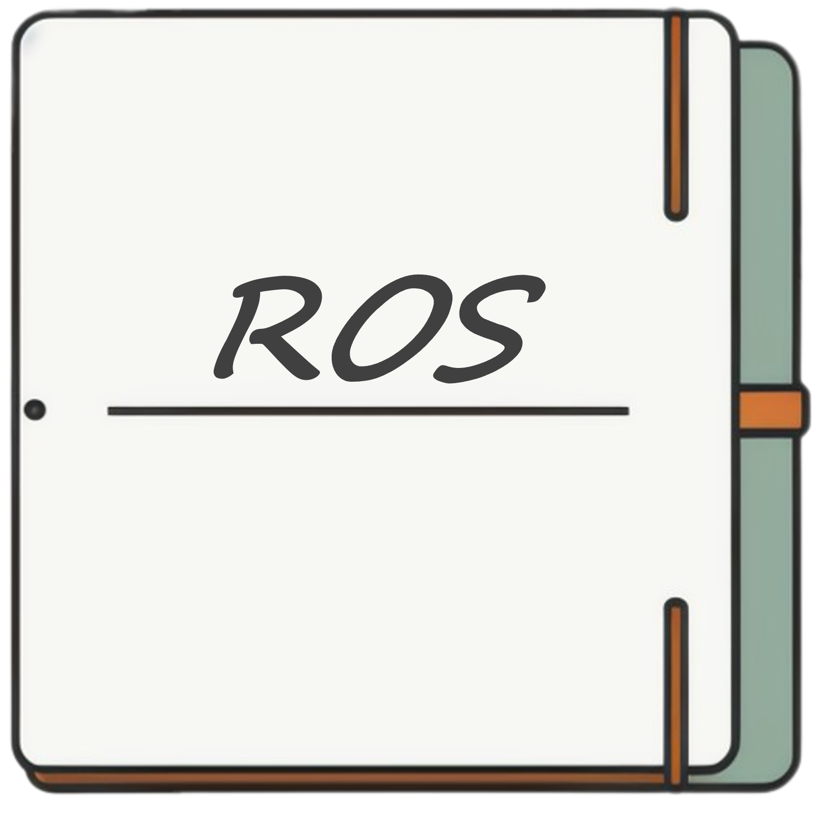

# ROS cookbook

解决方案索引库：记录基于 ROS（ROS1 和 ROS2）开发过程涉及的相关工具链、代码块

:raised_eyebrow: 欢迎交流（[Issues](https://github.com/Natsu-Akatsuki/ros_cookbook/issues)，[PR](https://github.com/Natsu-Akatsuki/ros_cookbook/pulls)，[Discussions](https://github.com/Natsu-Akatsuki/ros_cookbook/discussions)）

网站见：[ros_cookbook - Docs](https://natsu-akatsuki.github.io/ros_cookbook/)

## Contents

### :child: Beginner

- [Build Tool](Beginner/Build%20Tool.md): How to use Catkin, colcon...
- [CMake and Package](Beginner/CMake%20and%20Package.md): How to write CMake and Package.xml
- [Executor and Callback](Beginner/Executor%20and%20Callback.md): How to use multi-thread executor
- [Glossary](Beginner/Glossary.md): ROS concepts
- [Header and Module](Beginner/Header%20and%20Module.md)：Commonly used header file, module, library (e.g. extension library for Python)
- [Install](Beginner/Install.md): How to install ROS and ROS packages
- [Interface](Beginner/Interface.md): How to use ROS interface (e.g. msg, srv, action)
- [Launch](Beginner/Launch.md): How to use launch file
- [Logger](Beginner/Logger.md): How to use logger
- [Network](Beginner/Network.md): How to implement cross-computer communication
- [Node and Component](Beginner/Node%20and%20Component.md): How to write a basic ROS node and component
- [Parameter Server](Beginner/Parameter%20Server.md): How to use parameter server
- [Record](Beginner/Record.md): How to record and replay ROS interface
- [TF](Beginner/TF.md): How to use the transform
- [Time](Beginner/Time.md): How to use ROS clock sources

### :student: Intermediate

- [DDS](Intermediate/DDS.md)
- [Deployment](Intermediate/Deployment.md)
- [Assertion and Exception](Intermediate/Assertion%20and%20Exception.md)
- [Plugins](Intermediate/Plugins.md)
- [Signal](Intermediate/Signal.md): How to terminate a multi-thread process

### :hammer_and_wrench: Software and Tools

- [Blender](Software%20and%20Tools/Blender.md)
- [Gazebo](Software%20and%20Tools/Gazebo.md)
- [PlotJuggler](Software%20and%20Tools/PlotJuggler.md)
- [RViz](Software%20and%20Tools/RViz.md)
- [Tools](Software%20and%20Tools/Tools.md)

### :memo: Others

- [Code Style](Others/Code%20Style.md)

## FAQ

    
:question: <b>问题 1：</b>
        如何在 ROS2 找到对应的 Python API？
    

根据`C++`的相关代码和 API 进行初筛，然后再查看 [rclpy API 文档](https://docs.ros2.org/latest/api/rclpy/index.html)，找到对应的模块和代码接口，继而实现迁移

    
:question: <b>问题 2：</b>
        如何实现 ROS1 和 ROS2 代码的迁移？
    

- [ ] 过一遍 ChatGPT
- [ ] 经验泛化（谷歌，Stack Overflow，百度，曾经遇到过......）
- [ ] 查看例程

    
:question: <b>问题 3：</b>
        <a href="https://design.ros2.org/articles/why_ros2.html">为什么选择 ROS2</a>？
    

    
:question: <b>问题 4：</b>
        开发 ROS 工程的流程？
    

- [ ] 明确程序的功能，明确程序的输入和输出
- [ ] 进行快速原型开发，验证程序的功能
- [ ] 优化程序，提高程序的性能

    
:question: <b>问题 5：</b>
        <a href="https://www.zhihu.com/question/527984200/answer/2447182557">SLAM 在 ROS 下跑非 ROS 下跑的区别和意义是什么呢，以 ORBSLAM-2 为例？</a>
    

在 ROS 框架下开发和验证算法会更加的方便。首先，有丰富的三方支持。比如，我们可以直接使用厂家提供的 ROS 平台下的程序来读取传感器的数据，而不用自己再写程序来读取数据，而当然前提是供应商提供了相关的程序。其次，ROS 框架下包含一套进程通信的架构。通过消息的订阅和发布，回调函数的处理，我们就能够快速地实现进程通信。提供了算法开发和验证的一系列工具链。比如进行数据可视化的 RViz，数据录制的 rosbag，仿真平台 Gazebo

以 ORBSLAM2 为例，如果不依赖 ROS 的话，第一要自己手写对传感器数据读取的程序，第二，设计的算法如果是分模块，模块之间要通讯的话，还要
考量如何通讯；第三，还要写可视化的程序。凡此，都要花费大量的时间。

    
:question: <b>问题 6：</b>
        当前索引库与官方文档有何异同
    

其实在编者多次浏览官方文档后，会觉得官方文档已提供了详细的线索和解决方案，当前索引库只是多了 ROS1 和 ROS2 的整合和部分工程上的线索

## Reference

- [ROS2 cookbook](https://github.com/mikeferguson/ros2_cookbook)

## Master

- [ ] 能熟练地在 ROS 框架下进行算法的开发和验证
- [ ] 能熟练地定位和解决 ROS 开发过程中遇到的问题

## Roadmap

- [x] 2023.07.24-2023.07.31 修订所有文档
- [ ] 追加 giscus 评论系统
- [ ] 参考 ROS2 官网文档设计目录

## Contributors

